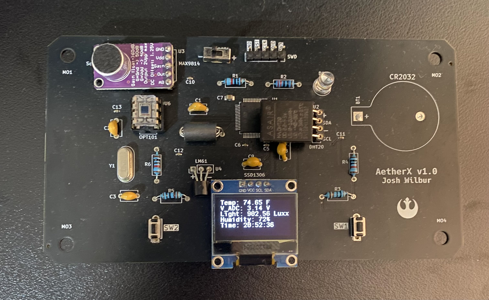

# AetherX

AetherX is a precision environmental sensor which can gather a number of statistics in real time. This device was designed with ease of use and portability in mind. This project is in a functional state and is considered "complete" for the time being. All features of this project, minus the microphone, are functional and calibrated. In the future, I plan to revisit this project to make improvements.

All code for this project is within Core/src. Schematic, PCB and assembly files are contained within AetherX_KiCad.

**Sensors:**

* LM61 - Temperature
* DHT20 - Relative humidity and temperature
* OPT101 - Light intensity at 650nm wavelength
* MAX9814 - Microphone with signal output

**Power**

This device is powered by 2x AA batteries. I tested the battery life of this device and found it can last ~1 month before a battery change is needed. Further improvements could be made to the code for additional power savings.

* 2/25/25: 5mA @ 3V (15mW)
* 7/30/25  3.8mA @ 3V (11.4mW)

# TODO:

**Software**

* Re-do reading functions with ADC rank (only do readings when displayed)
* Screens: ADC voltage stats, humidity, time/date, clicker, settings?
* Restructure data in structs?
* Signal processing for MAX9814 (frequency data via FFT, sound level in dB)

**Future Work**

* Wireless daughter boards (STM32WB55, 3D print sphere case?)
* Data logging (>24hrs)
